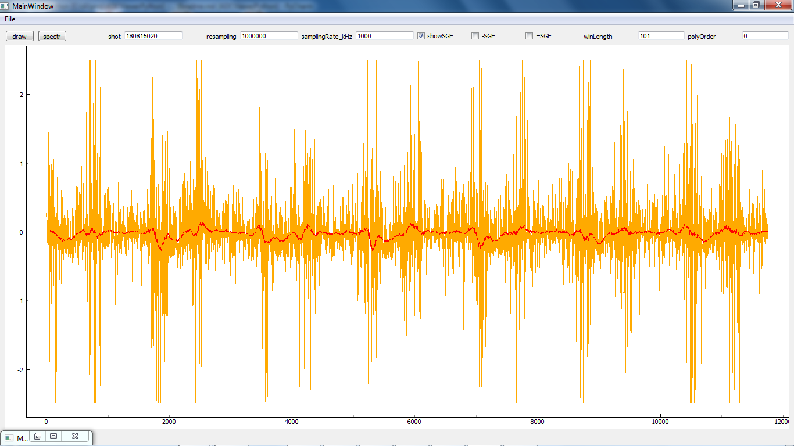
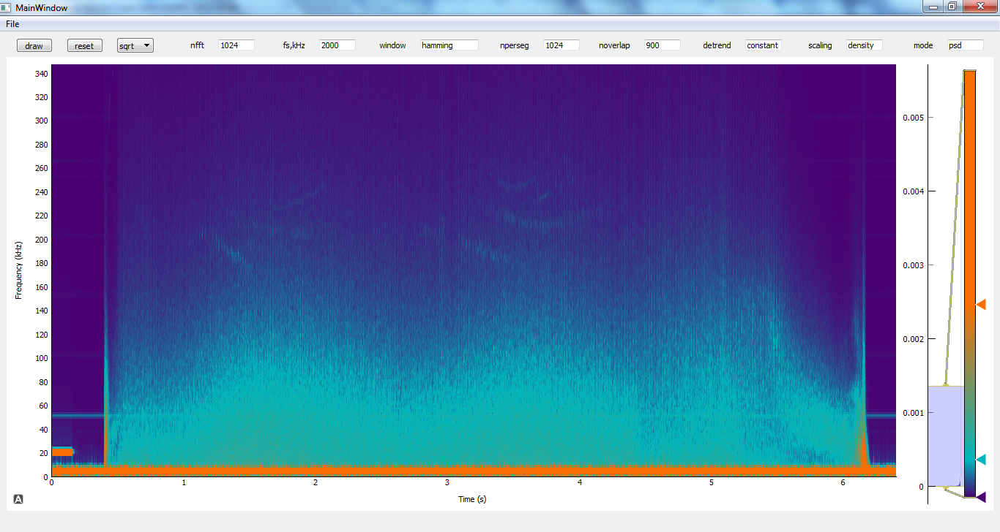

w7x-dataViewer
=============

This is an  application that allows to visualize and process data that was recorded
with analog digital converters of different diagnostics
and saved as a text files or fetched directly from the Wendelstein-7X MDSPlus database

Screenshot
==========

The application is based on the next packages:

* PyQt5
* Pandas
* Numpy
* SciPy
* Pyqtgraph

The interface was created with Qt Designer

A single executable file can be produced with Pyinstaller for both Windows and Linux.
In order to achieve a smaller size of produced file,
do it inside a separate python virtual environment with only necessary packages installed.
In case you have trouble with Pandas import, try recommendation provided by Zero
from this post https://stackoverflow.com/questions/33001327/importerror-with-pyinstaller-and-pandas

LICENSING
---------

Copyright (c) 2017 onward, Aleksey Beletskii  <beletskiial@gmail.com>
All rights reserved

github: https://github.com/alekseybeletskii

The w7x-dataViewer software serves for visualization and simple processing
of any data recorded with Analog Digital Converters in binary or text form.

Commercial support is available. To find out more contact the author directly.

Redistribution and use in source and binary forms, with or without
modification, are permitted provided that the following conditions are met:

  1. Redistributions of source code must retain the above copyright notice, this
     list of conditions and the following disclaimer.
  2. Redistributions in binary form must reproduce the above copyright notice,
     this list of conditions and the following disclaimer in the documentation
     and/or other materials provided with the distribution.

The software is distributed to You under terms of the GNU General Public
License. This means it is "free software". However, any program, using
ADCViewerPython _MUST_ be the "free software" as well.
See the GNU General Public License for more details
(file ./COPYING in the root of the distribution
or website <http://www.gnu.org/licenses/>)

THIS SOFTWARE IS PROVIDED BY THE COPYRIGHT HOLDERS AND CONTRIBUTORS "AS IS" AND
ANY EXPRESS OR IMPLIED WARRANTIES, INCLUDING, BUT NOT LIMITED TO, THE IMPLIED
WARRANTIES OF MERCHANTABILITY AND FITNESS FOR A PARTICULAR PURPOSE ARE
DISCLAIMED. IN NO EVENT SHALL THE COPYRIGHT OWNER OR CONTRIBUTORS BE LIABLE FOR
ANY DIRECT, INDIRECT, INCIDENTAL, SPECIAL, EXEMPLARY, OR CONSEQUENTIAL DAMAGES
(INCLUDING, BUT NOT LIMITED TO, PROCUREMENT OF SUBSTITUTE GOODS OR SERVICES;
LOSS OF USE, DATA, OR PROFITS; OR BUSINESS INTERRUPTION) HOWEVER CAUSED AND
ON ANY THEORY OF LIABILITY, WHETHER IN CONTRACT, STRICT LIABILITY, OR TORT
(INCLUDING NEGLIGENCE OR OTHERWISE) ARISING IN ANY WAY OUT OF THE USE OF THIS
SOFTWARE, EVEN IF ADVISED OF THE POSSIBILITY OF SUCH DAMAGE.
